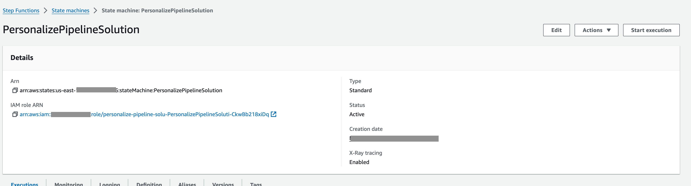
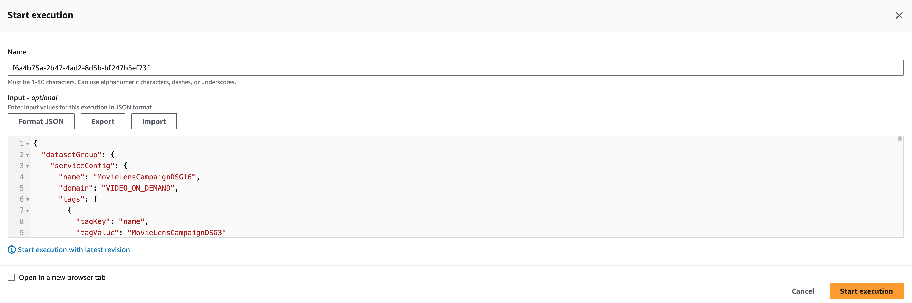

# Automating Personalized Experiences with Machine Learning using AWS MLOps for Amazon Personalize

This repository contains source code and infrastructure as code templates using AWS CDK to implement MLOps for Amazon
Personalize using AWS services.

Amazon Personalize is a fully managed service that makes it easy for developers to create personalized recommendations.
However, managing the end-to-end lifecycle of an Amazon Personalize workflow including data preparation, model training,
deployment, and monitoring can be complex.

This solution aims to automate the MLOps workflow for Amazon Personalize using AWS CDK L3 constructs and services like
Step Functions, EventBridge, S3.

The key components of the solution include:

- Automated workflows for dataset import, model training and deployment using AWS Step Functions.
- The solution leverages AWS SDK integrations to programmatically interact with Amazon Personalize for creating
  artifacts such as dataset groups, datasets, solutions, and more. Using the SDK allows the workflow to natively
  interface with Personalize APIs to automate the end-to-end machine learning lifecycle.
- The solution utilizes Amazon EventBridge to publish events for key actions in the workflow. This allows users to react
  to events such as solution version creation, dataset creation, dataset group creation, etc. By integrating with
  EventBridge, the solution provides an event-driven architecture that enables use cases such as triggering
  notifications, workflows, and automation in response to Amazon Personalize events.
- Scalable workflow orchestration using Step Functions
- Automated resource provisioning using AWS CDK.

This is an AWS CDK construct that automatically provisions the necessary resources to implement MLOps for Amazon
Personalize.

By leveraging AWS services and the AWS CDK, this solution enables teams to quickly setup a production-ready environment
for personalization and recommendations. Developers can focus on the machine learning logic while the framework handles
orchestration and deployment.

## Table of Contents

## Arhitecture

## AWS CDK Constructs

[AWS CDK Solutions Constructs](https://aws.amazon.com/solutions/constructs/) make it easier to consistently create
well-architected applications. All AWS Solutions Constructs are reviewed by AWS and use best practices established by
the AWS Well-Architected Framework. This solution uses a new
CDK [L3 construct](https://docs.aws.amazon.com/cdk/v2/guide/constructs.html#constructs_lib) which deploys the
architecture using AWS Step Functions, Amazon S3 and CloudWatch

## Deployment

### Prerequisites

The following procedures assumes that all the OS-level configuration has been completed. They are:

- [AWS Command Line Interface](https://aws.amazon.com/cli/)
- [Python](https://www.python.org/) 3.12 or newer
- [Node.js](https://nodejs.org/en/) 20.16.0 or newer
- [AWS CDK](https://aws.amazon.com/cdk/) 2.88.0 or newer
- [Amazon Corretto OpenJDK](https://docs.aws.amazon.com/corretto/) 17.0.4.1
- Docker 27.5.1 or newer (required for Lambda function bundling)

> **Please ensure you test the templates before updating any production deployments.**

### 1. Download or clone this repo

```

git clone https://github.com/aws-samples/automate-mlops-personalize-cdk-pipeline

```

### 2. Create a Python virtual environment for development

```bash
python3 -m venv .venv
source ./.venv/bin/activate
pip install -r requirements.txt
```

### 3. Configure AWS credentials using AWS CLI

```bash
aws configure
```

You will be prompted to enter:
* AWS Access Key ID: YOUR_ACCESS_KEY_ID
* AWS Secret Access Key: YOUR_SECRET_ACCESS_KEY
* Default region name: YOUR_REGION (e.g., us-east-1)
* Default output format: json

Alternatively you can also use:
```bash
export AWS_ACCESS_KEY_ID=YOUR_ACCESS_KEY_ID
export AWS_SECRET_ACCESS_KEY=YOUR_SECRET_ACCESS_KEY
export AWS_SESSION_TOKEN=YOUR_AWS_SESSION_TOKEN
export AWS_DEFAULT_REGION=YOUR_REGION
```

### 4. Build the solution for deployment (Using AWS CDK)

#### Define a stack

To define a Personalize MlOps pipeline instance ```PersonalizeMlOpsPipeline``` do the following, modify the below based on your needs (
Refer [personalize_pipeline_stack.py](personalize/infrastructure/stacks/personalize_pipeline_stack.py) for the complete
example):

```python 
  PersonalizeMlOpsPipeline(
            self, 'PersonalizePipelineSolution',
            pre_processing_config={
                "job_class": PreprocessingGlueJobFlow
            },
            enable_filters=True,
            enable_event_tracker=True,
            recommendation_config=[
                {
                    "type": "solutions",
                    "inference_options": ["campaigns"]
                },
                {
                    "type": "recommenders"
                }
            ]

        )


```

##### Description

Creates a Personalize ML pipeline solution with the following configuration:

- `'PersonalizePipelineSolution'` - Name of the pipeline solution stack

- `pre_processing_config` - Configuration for pre-processing job to transform raw data into a format usable by
  Personalize. FOr using Glue jobs for preprocessing specify the Glue job class (PreprocessingGlueJobFlow) as a value to the parameter ```job_class```. Currently only Glue Jobs are supported. You can pass your glue job name that you need to run as a part of the input config. This does not deploy the actual Glue job responsible for pre-processing the files, the actual glue jobs will have to be created outside of this solution and the name passed as a input to the state machine. A sample [glue job](glue_job/movie_script.py) is supplied in this repo which shows how pre-processing can be done.

- `enable_filters` - Boolean to enable dataset filters for pre-processing, when set to true the pipeline will create
  state machines needed to create filters. Supported options are ```true``` or ```false```. If you specify this value a false the corresponding state machine is not deployed.

- `enable_event_tracker` - Boolean to enable Personalize event tracker, when set to true the pipeline will create state
  machines needed to create an event tracker. Supported options are ```true``` or ```false```. If you specify this value a false the corresponding state machine is not deployed.

- `recommendation_config` - A dict with option for recommendations. Currently 2 types are supported ```solutions``` and ```recommenders```, within the solutions type you can have multiple options such as ```"campaigns", "batchInferenceJobs", "batchSegmentJobs"``` Based on the selected options
  corresponding state machine and components are created. In the above example we have used campaigns as the option which means only the campaigns state machine will be deployed with the cdk.

Once the infrastructure is deployed you can also enable and disable certain options through the state machine input configuration file. Using this cdk code you can control what components are deployed in your AWS environment.

#### Deploy the stack

Packaging and deploying the solution with the AWS CDK allows for the most flexibility in development

```bash
Start the docker engine if it is not running.

# bootstrap CDK (required once - deploys a CDK bootstrap CloudFormation stack for assets)
cdk bootstrap

# build the solution
cdk synth

# build and deploy the solution
cdk deploy
```

### 5. Test the pipeline

Following are some `Prerequisites` before you start running the pipeline:

#### Create an Amazon S3 bucket to store the datasets
1. Log in to the AWS Management Console and navigate to the S3 service, in the same region where you deployed the Cloudformation Stack.
2. Click on "Create bucket".
3. Enter a unique bucket name (e.g., `personalize-datasets`).
4. Select the AWS Region where you want to create the bucket.
5. Keep the default settings for the remaining options, and click "Create bucket".

#### Creating an IAM Role for Amazon Personalize

1. Navigate to the IAM service in the AWS Management Console.
2. Click on "Roles" in the left-hand navigation pane.
3. Click on "Create role".
4. Under "Select trusted entity", choose "AWS service".
5. Search for and select "Personalize" from the list of services.
6. Click "Next: Permissions".
7. Click "Next: Tags" (no need to add tags for this example).
8. Click "Next: Review".
9. Enter a role name (e.g., `personalize-role`) and an optional description.
10. Click "Create role".

#### Attaching an IAM Policy to the Role

1. In the IAM console, navigate to "Roles".
2. Find the role you just created (`personalize-role`) and click on its name.
3. Click on the "Attach policies" button.
4. Search for and select the "AmazonPersonalizeFullAccess" policy. Instead of using managed policy you can also create a new policy with appropriate access based on your org polices. When creating the new policy, ensure that you provide access to the S3 bucket containing the dataset that will be used for Amazon Personalize. This approach allows you to follow the principle of least privilege, granting only the required permissions instead of using a broad managed policy
5. Click "Attach policy".

#### Modify the S3 bucket policy
1. In the AWS Management Console, navigate to the S3 service.
2. Click on the name of the S3 bucket you created earlier (e.g., `personalize-datasets`).
3. Click on the "Permissions" tab.
4. Scroll down to the "Bucket Policy" section and click on "Edit" (or "Edit bucket policy" if there's an existing policy).
5. Replace the existing policy with the following JSON code, replacing `<BUCKET_NAME>` with your S3 bucket:

```json
{
    "Version": "2012-10-17",
    "Statement": [
        {
            "Sid": "PersonalizeS3BucketAccessPolicy",
            "Effect": "Allow",
            "Principal": {
                 "Service": "personalize.amazonaws.com"
            },
            "Action": [
                "s3:ListBucket",
                "s3:GetObject",
                "s3:PutObject",
                "s3:DeleteObject"
            ],
            "Resource": [
                "arn:aws:s3:::<BUCKET_NAME>",
                "arn:aws:s3:::<BUCKET_NAME>/*"
            ]
        }
    ]
}
```

#### (Optional) Configure the Glue Job to create the output files

If you already have the [required files](https://docs.aws.amazon.com/personalize/latest/dg/preparing-training-data.html) then you can upload in the S3 bucket and provide the path in the input configuration file that will be created in the next step. If you don't have input files, then we have provided a associated glue job script which you can configure in the input config file. Here are the steps:

1. Navigate to AWS Glue
   - Sign in to the AWS Management Console
   - Search for "AWS Glue" in the services
   - Go to "ETL Jobs" in the left navigation pane

2. Create a new job
   - Click "Create job"
   - Select "Script editor"
   - Choose "Spark" as the type
   - Select Upload script and upload the [Glue Job script](https://github.com/aws-samples/automate-mlops-personalize-cdk-pipeline/blob/main/glue_job/movie_script.py) provided in the repo
   - CLick Create Script
   - When the Script Editor opens up replace the <BUCKET_NAME> with the name of the bucket that you created above.
   - Enter a Job name such as `personalize-mlops-glue-job`
   - Select "Glue version" (e.g., Glue 4.0)
   - Choose "Python" as the language
   - Select an appropriate IAM role, when creating this role we add a managed policy `AWSGlueServiceRole` along with the permissions listed below. As a best practice you can configure the IAM role to provide only necessary access.
   **Note**: Ensure your IAM role has these minimum permissions:
    ```json
    {
        "Version": "2012-10-17",
        "Statement": [
            {
                "Effect": "Allow",
                "Action": [
                    "s3:GetObject",
                    "s3:PutObject"
                ],
                "Resource": [
                    "arn:aws:s3:::<REPLACE_WITH_S3_BUCKET_NAME>/*",
                    "arn:aws:s3:::<REPLACE_WITH_S3_BUCKET_NAME>/*"
                ]
            },
            {
                "Effect": "Allow",
                "Action": [
                    "logs:CreateLogGroup",
                    "logs:CreateLogStream",
                    "logs:PutLogEvents"
                ],
                "Resource": ["arn:aws:logs:*:*:/aws-glue/*"]
            }
        ]
    }
   ```
   - Modify rest of the options based on your needs, I keep rest of the options as default.

3. Save and run
   - Click "Save"
   - Click "Run job" to test
   - Monitor the execution in the "Runs" tab
   - After the execution is successful you will see the following files in the S3 bucket:
     - interactions.csv
     - item-meta.csv
     - users.csv
     Make a note of the S3 paths of these files you will need them to configure the input file to S3


#### (Optional) Upload input files for batchInference and batch segment jobs
If you plan to create Batch Inference and Batch Segment jobs for Personalize you will have to upload the corresponding input files to s3 and provide the path in the input configuration, as shown below:

Refer [Getting batch item recommendations with custom resources]()
```json 
"batchSegmentJobs" : [
        {
          "serviceConfig": {
            "jobName": "MovieLensBatchSegmentJob11",
            "roleArn": "arn:aws:iam::<REPLACE_WITH_AWS_ACCOUNT_ID>:role/personalize-role",
            "jobInput": {
              "s3DataSource": {
                "path": "s3://<bucket-name>/<input-path>/"
              }
            },
            "jobOutput": {
              "s3DataDestination": {
                "path": "s3://<bucket-name>/<output-path>/"
              }
            }
          },
          "createBatchSegmentJob": true
        }
      ]
```

#### Create input configuration for Step Functions

The solution uses configurations that is passed as an input to the state machine. The input contains all the necessary
information to create and maintain your resources in Amazon Personalize.

The file can contain the following top level objects

- `datasetGroup`
- `datasets`
- `eventTracker`
- `filters`
- `solutions` (can contain `campaigns`, `batchInferenceJobs` and `batchSegmentJobs`)
- `recommenders`

1. Customize the configuration file according to your specific requirements and include or exclude sections based on the Amazon Personalize artifacts you want to create. 
2. For the dataset import jobs in the datasets section, replace BUCKET_NAME with the appropriate values that you have noted in the previous Glue Job setup steps or any custom files that you have. 
3. Replace the roleArn with the role that you created before e.g., `personalize-role`
4. Similarly, update the BUCKET_NAME and IAM ROLE ARN for the batch inference and batch segment jobs sections. You can also change the path to the actual dataset files present in the S3 buckets.
5. If you have setup a Glue Job in previous step, add that detail in the input file as shown below

         ```json
        "preprocessing": {
            "jobName": "personalize-mlops-glue-job",
            "run": true
          }
          ```

You can checkout sample parameters files for [retail](personalize/sample_configs/input_retail.json)
and [media](personalize/sample_configs/input_media.json) use case.


<details>
<summary>Example of an input file for the media use case</summary>

Let's understand the configuration files, the following is the [media](personalize/sample_configs/input_media.json) input
file:

```json

{
  "datasetGroup": {
    "serviceConfig": {
      "name": "MovieLensCampaignDSG16",
      "domain": "VIDEO_ON_DEMAND",
      "tags": [
        {
          "tagKey": "name",
          "tagValue": "MovieLensCampaignDSG3"
        }
      ]
    },
    "datasets": [
      {
        "type": "USERS",
        "schema": {
          "serviceConfig": {
            "schema": {
              "type": "record",
              "name": "Users",
              "namespace": "com.amazonaws.personalize.schema",
              "fields": [
                {
                  "name": "USER_ID",
                  "type": "string"
                },
                {
                  "name": "GENDER",
                  "type": "string",
                  "categorical": true
                },
                {
                  "name": "AGE",
                  "type": [
                    "null",
                    "int"
                  ]
                }
              ],
              "version": "1.0"
            },
            "name": "UserSchemaMedia"
          },
          "schemaVersion": "v5"
        },
        "dataset": {
          "serviceConfig": {
            "name": "UserDatasetMedia",
            "tags": [
              {
                "tagKey": "string",
                "tagValue": "string"
              }
            ]
          }
        },
        "datasetImportJob": {
          "serviceConfig": {
            "dataSource": {
              "dataLocation": "s3://<BUCKET_NAME>/users_age.csv"
            },
            "roleArn": "IAM_ROLE_ARN",
            "tags": [
              {
                "tagKey": "string",
                "tagValue": "string"
              }
            ],
            "importMode": "FULL",
            "jobName": "UsersDatasetImportJob"
          },
          "createNewJob": true
        }
      },
      {
        "type": "ITEMS",
        "schema": {
          "serviceConfig": {
            "schema": {
              "type": "record",
              "name": "Items",
              "namespace": "com.amazonaws.personalize.schema",
              "fields": [
                {
                  "name": "ITEM_ID",
                  "type": "string"
                },
                {
                  "name": "GENRES",
                  "type": "string",
                  "categorical": true
                },
                {
                  "name": "YEAR",
                  "type": "int"
                },
                {
                  "name": "CREATION_TIMESTAMP",
                  "type": "long"
                },
                {
                  "name": "DESCRIPTION",
                  "type": [
                    "null",
                    "string"
                  ],
                  "textual": true
                }
              ],
              "version": "1.0"
            },
            "name": "ItemsSchemaMedia"
          },
          "schemaVersion": "v4"
        },
        "dataset": {
          "serviceConfig": {
            "name": "ItemsDatasetMedia",
            "tags": [
              {
                "tagKey": "string",
                "tagValue": "string"
              }
            ]
          }
        },
        "datasetImportJob": {
          "serviceConfig": {
            "dataSource": {
              "dataLocation": "s3://<BUCKET_NAME>/item-meta_with_desc.csv"
            },
            "roleArn": "IAM_ROLE_ARN",
            "tags": [
              {
                "tagKey": "string",
                "tagValue": "string"
              }
            ],
            "importMode": "FULL",
            "jobName": "ItemsDatasetImportJob"
          },
          "createNewJob": true
        }
      },
      {
        "type": "INTERACTIONS",
        "schema": {
          "serviceConfig": {
            "schema": {
              "type": "record",
              "name": "Interactions",
              "namespace": "com.amazonaws.personalize.schema",
              "fields": [
                {
                  "name": "USER_ID",
                  "type": "string"
                },
                {
                  "name": "ITEM_ID",
                  "type": "string"
                },
                {
                  "name": "EVENT_TYPE",
                  "type": "string"
                },
                {
                  "name": "TIMESTAMP",
                  "type": "long"
                }
              ],
              "version": "1.0"
            },
            "name": "InteractionsSchemaMedia"
          },
          "schemaVersion": "v4"
        },
        "dataset": {
          "serviceConfig": {
            "name": "InteractionsDatasetMedia",
            "tags": [
              {
                "tagKey": "string",
                "tagValue": "string"
              }
            ]
          }
        },
        "datasetImportJob": {
          "serviceConfig": {
            "dataSource": {
              "dataLocation": "s3://<BUCKET_NAME>/interactions.csv"
            },
            "roleArn": "IAM_ROLE_ARN",
            "tags": [
              {
                "tagKey": "string",
                "tagValue": "string"
              }
            ],
            "importMode": "FULL",
            "jobName": "InteractionsDatasetImportJob"
          },
          "createNewJob": true
        }
      },
      {
        "type": "ACTIONS",
        "schema": {
          "serviceConfig": {
            "schema": {
              "type": "record",
              "name": "Actions",
              "namespace": "com.amazonaws.personalize.schema",
              "fields": [
                {
                  "name": "ACTION_ID",
                  "type": "string"
                },
                {
                  "name": "VALUE",
                  "type": [
                    "null",
                    "long"
                  ]
                },
                {
                  "name": "MEMBERSHIP_LEVEL",
                  "type": [
                    "null",
                    "string"
                  ],
                  "categorical": true
                },
                {
                  "name": "CREATION_TIMESTAMP",
                  "type": "long"
                },
                {
                  "name": "REPEAT_FREQUENCY",
                  "type": [
                    "long",
                    "null"
                  ]
                }
              ],
              "version": "1.0"
            },
            "name": "ActionsSchemaMedia"
          },
          "schemaVersion": "v1"
        },
        "dataset": {
          "serviceConfig": {
            "name": "ActionsDatasetMedia",
            "tags": [
              {
                "tagKey": "string",
                "tagValue": "string"
              }
            ]
          }
        },
        "datasetImportJob": {
          "serviceConfig": {
            "dataSource": {
              "dataLocation": "s3://<BUCKET_NAME>/actions.csv"
            },
            "roleArn": "IAM_ROLE_ARN",
            "tags": [
              {
                "tagKey": "string",
                "tagValue": "string"
              }
            ],
            "importMode": "FULL",
            "jobName": "ActionsDatasetImportJob"
          },
          "createNewJob": true
        }
      },
      {
        "type": "ACTION_INTERACTIONS",
        "schema": {
          "serviceConfig": {
            "schema": {
              "type": "record",
              "name": "ActionInteractions",
              "namespace": "com.amazonaws.personalize.schema",
              "fields": [
                {
                  "name": "USER_ID",
                  "type": "string"
                },
                {
                  "name": "ACTION_ID",
                  "type": "string"
                },
                {
                  "name": "EVENT_TYPE",
                  "type": "string"
                },
                {
                  "name": "TIMESTAMP",
                  "type": "long"
                }
              ],
              "version": "1.0"
            },
            "name": "ActionsInteractionsSchemaMedia"
          },
          "schemaVersion": "v1"
        },
        "dataset": {
          "serviceConfig": {
            "name": "ActionsInteractionsDatasetMedia",
            "tags": [
              {
                "tagKey": "string",
                "tagValue": "string"
              }
            ]
          }
        },
        "datasetImportJob": {
          "serviceConfig": {
            "dataSource": {
              "dataLocation": "s3://<BUCKET_NAME>/actions_interactions.csv"
            },
            "roleArn": "IAM_ROLE_ARN",
            "tags": [
              {
                "tagKey": "string",
                "tagValue": "string"
              }
            ],
            "importMode": "FULL",
            "jobName": "ActionsInteractionsDatasetImportJob"
          },
          "createNewJob": true
        }
      }
    ]
  },
  "filters": [
    {
      "serviceConfig": {
        "name": "MovieLensCampaignWatchedFilter",
        "filterExpression": "INCLUDE ItemID WHERE Interactions.event_type IN (\"Watch\")",
        "tags": [
          {
            "tagKey": "tag11",
            "tagValue": "key11"
          }
        ]
      }
    },
    {
      "serviceConfig": {
        "name": "MovieLensCampaignUnwatchedFilter",
        "filterExpression": "EXCLUDE ItemID WHERE Interactions.event_type IN (\"Watch\")",
        "tags": [
          {
            "tagKey": "tag11",
            "tagValue": "key11"
          }
        ]
      }
    }
  ],
  "eventTracker": {
    "serviceConfig": {
      "name": "MovieLensCampaignEventTracker12",
      "tags": [
        {
          "tagKey": "tag10",
          "tagValue": "key10"
        }
      ]
    }
  },
  "solutions": [
    {
      "serviceConfig": {
        "name": "MovieLensCampaignSolutionPersonalizedRanking11",
        "recipeArn": "arn:aws:personalize:::recipe/aws-personalized-ranking"
      },
      "solutionVersion": {
        "createNewSolutionVersion": true,
        "serviceConfig": {
          "trainingMode": "FULL",
          "tags": [
            {
              "tagKey": "tag5",
              "tagValue": "key5"
            }
          ]
        }
      },
      "campaigns": [
        {
          "createCampaign": true,
          "solutionversion": "",
          "serviceConfig": {
            "name": "MovieLensCampaign11",
            "minProvisionedTPS": 1
          }
        }
      ],
      "batchInferenceJobs": [],
      "batchSegmentJobs": []
    },
    {
      "serviceConfig": {
        "name": "MovieLensCampaignSolutionSimilarItems12",
        "recipeArn": "arn:aws:personalize:::recipe/aws-similar-items"
      },
      "solutionVersion": {
        "createNewSolutionVersion": true,
        "serviceConfig": {
          "trainingMode": "FULL",
          "tags": [
            {
              "tagKey": "tag5",
              "tagValue": "key5"
            }
          ]
        }
      },
      "campaigns": [],
      "batchInferenceJobs": [
        {
          "serviceConfig": {
            "jobName": "MovieLensBatchInferenceJob11",
            "roleArn": "IAM_ROLE_ARN",
            "jobInput": {
              "s3DataSource": {
                "path": "s3://<BUCKET_NAME>/media-inference-input/"
              }
            },
            "jobOutput": {
              "s3DataDestination": {
                "path": "s3://<BUCKET_NAME>/media-inference-output/"
              }
            }
          },
          "createBatchInferenceJob": true
        }
      ],
      "batchSegmentJobs": []
    },
    {
      "serviceConfig": {
        "name": "MovieLensBatchSegmentSolution12",
        "recipeArn": "arn:aws:personalize:::recipe/aws-item-affinity"
      },
      "solutionVersion": {
        "createNewSolutionVersion": true,
        "serviceConfig": {
          "trainingMode": "FULL",
          "tags": [
            {
              "tagKey": "tag5",
              "tagValue": "key5"
            }
          ]
        }
      },
      "campaigns": [],
      "batchInferenceJobs": [],
      "batchSegmentJobs": [
        {
          "serviceConfig": {
            "jobName": "MovieLensBatchSegmentJob11",
            "roleArn": "IAM_ROLE_ARN",
            "jobInput": {
              "s3DataSource": {
                "path": "s3://<BUCKET_NAME>/media-segment-input/"
              }
            },
            "jobOutput": {
              "s3DataDestination": {
                "path": "s3://<BUCKET_NAME>/media-segment-output/"
              }
            }
          },
          "createBatchSegmentJob": true
        }
      ]
    }
  ],
  "recommenders": [
    {
      "serviceConfig": {
        "name": "MovieLensRecommender",
        "recipeArn": "arn:aws:personalize:::recipe/aws-vod-most-popular",
        "tags": [
          {
            "tagKey": "hello13",
            "tagValue": "world13"
          }
        ]
      },
      "createRecommender": true
    }
  ]
}


```
</details>

<details>
<summary>Here's the table with the description of each property, whether it's required, and valid values, formatted for a GitHub README</summary>

| Property | Description                                                                                                                                                                                                                                                                                                                                                                                                                                                               | IsRequired                                            | Valid Values                                        |
| --- |---------------------------------------------------------------------------------------------------------------------------------------------------------------------------------------------------------------------------------------------------------------------------------------------------------------------------------------------------------------------------------------------------------------------------------------------------------------------------|-------------------------------------------------------|-----------------------------------------------------|
| `datasetGroup` | Root Element                                                                                                                                                                                                                                                                                                                                                                                                                                                              | Required                                              | Object                                              |
| `datasetGroup.serviceConfig` | Configuration for the dataset group                                                                                                                                                                                                                                                                                                                                                                                                                                       | Required                                              | Object                                              |
| `datasetGroup.serviceConfig.name` | Name of the dataset group                                                                                                                                                                                                                                                                                                                                                                                                                                                 | Required                                              | String                                              |
| `datasetGroup.serviceConfig.domain` | Domain of the dataset group                                                                                                                                                                                                                                                                                                                                                                                                                                               | Required                                              | Enum: `VIDEO_ON_DEMAND`, `ECOMMERCE`                |
| `datasetGroup.serviceConfig.tags` | Tags for the dataset group                                                                                                                                                                                                                                                                                                                                                                                                                                                | Optional                                              | Array of Tag objects                                |
| `datasetGroup.datasets` | Array of datasets in the dataset group, the required datasets depend upon the recipe that you. The dataset properties are marked as required if you decide to specify that dataset.                                                                                                                                                                                                                                                                                       | Required                                              | Array of Dataset objects                            |
| `datasetGroup.datasets[].type` | Type of the dataset                                                                                                                                                                                                                                                                                                                                                                                                                                                       | Required                                              | Enum: `USERS`, `ITEMS`, `INTERACTIONS`, `ACTIONS`, `ACTION_INTERACTIONS` |
| `datasetGroup.datasets[].schema` | Schema Information for the dataset                                                                                                                                                                                                                                                                                                                                                                                                                                        | Required                                              | Object                                              |
| `datasetGroup.datasets[].schema.serviceConfig` | Configuration for the schema, properties listed here are directly passed to the API call                                                                                                                                                                                                                                                                                                                                                                                  | Required                                              | Object                                              |
| `datasetGroup.datasets[].schema.serviceConfig.schema` | Schema definition, refer [VIDEO_ON_DEMAND datasets and schemas](https://docs.aws.amazon.com/personalize/latest/dg/VIDEO-ON-DEMAND-datasets-and-schemas.html) for more information. For structure of the schema refer [this example on Interactions dataset](https://docs.aws.amazon.com/personalize/latest/dg/VIDEO-ON-DEMAND-interactions-dataset.html#VIDEO-ON-DEMAND-interactions-schema) for an example                                                               | Required                                              | Object                                              |
| `datasetGroup.datasets[].schema.schemaVersion` | Version of the schema                                                                                                                                                                                                                                                                                                                                                                                                                                                     | Required                                              | String                                              |
| `datasetGroup.datasets[].dataset` | Top level object reprsenting the configuration of the dataset                                                                                                                                                                                                                                                                                                                                                                                                             | Required                                              | Object                                              |
| `datasetGroup.datasets[].dataset.serviceConfig` | Dataset config, properties listed here are directly passed to the API call                                                                                                                                                                                                                                                                                                                                                                                                | Required                                              | Object                                              |
| `datasetGroup.datasets[].dataset.serviceConfig.name` | Name of the dataset                                                                                                                                                                                                                                                                                                                                                                                                                                                       | Required                                              | String                                              |
| `datasetGroup.datasets[].dataset.serviceConfig.tags` | Tags for the dataset                                                                                                                                                                                                                                                                                                                                                                                                                                                      | Optional                                              | Array of Tag objects                                |
| `datasetGroup.datasets[].datasetImportJob` | Configuration for the dataset import job                                                                                                                                                                                                                                                                                                                                                                                                                                  | Required                                              | Object                                              |
| `datasetGroup.datasets[].datasetImportJob.serviceConfig` | Configuration for the dataset import job, properties listed here are directly passed to the API call                                                                                                                                                                                                                                                                                                                                                                      | Required                                              | Object                                              |
| `datasetGroup.datasets[].datasetImportJob.serviceConfig.dataSource` | Data source for the import job                                                                                                                                                                                                                                                                                                                                                                                                                                            | Required                                              | Object                                              |
| `datasetGroup.datasets[].datasetImportJob.serviceConfig.dataSource.dataLocation` | S3 location of the data                                                                                                                                                                                                                                                                                                                                                                                                                                                   | Required                                              | String                                              |
| `datasetGroup.datasets[].datasetImportJob.serviceConfig.roleArn` | ARN of the IAM role for the import job                                                                                                                                                                                                                                                                                                                                                                                                                                    | Required                                              | String                                              |
| `datasetGroup.datasets[].datasetImportJob.serviceConfig.tags` | Tags for the import job                                                                                                                                                                                                                                                                                                                                                                                                                                                   | Optional                                              | Array of Tag objects                                |
| `datasetGroup.datasets[].datasetImportJob.serviceConfig.importMode` | Specify how to add the new records to an existing dataset. The default import mode is FULL. If you haven’t imported bulk records into the dataset previously, you can only specify FULL. Specify FULL to overwrite all existing bulk data in your dataset. Data you imported individually is not replaced.  Specify INCREMENTAL to append the new records to the existing data in your dataset. Amazon Personalize replaces any record with the same ID with the new one. | Required                                              | Enum: `FULL`, `INCREMENTAL`                         |
| `datasetGroup.datasets[].datasetImportJob.serviceConfig.jobName` | Name of the import job                                                                                                                                                                                                                                                                                                                                                                                                                                                    | Required                                              | String                                              |
| `datasetGroup.datasets[].datasetImportJob.createNewJob` | Whether to create a new import job                                                                                                                                                                                                                                                                                                                                                                                                                                        | Required                                              | Boolean                                             |
| `filters` | Array of filters, array could be empty. If you decide to specify a filter, mention the properties that are marked as required.                                                                                                                                                                                                                                                                                                                                            | Optional                                              | Array of Filter objects                             |
| `filters[].serviceConfig` | Configuration for the filter                                                                                                                                                                                                                                                                                                                                                                                                                                              | Required                                              | Object                                              |
| `filters[].serviceConfig.name` | Name of the filter                                                                                                                                                                                                                                                                                                                                                                                                                                                        | Required                                              | String                                              |
| `filters[].serviceConfig.filterExpression` | The filter expression defines which items are included or excluded from recommendations. Filter expression must follow specific format rules. For information about filter expression structure and syntax, see  [Filter expressions](https://docs.aws.amazon.com/personalize/latest/dg/filter-expressions.html).                                                                                                                                                         | Required                                              | String                                              |
| `filters[].serviceConfig.tags` | Tags for the filter                                                                                                                                                                                                                                                                                                                                                                                                                                                       | Optional                                              | Array of Tag objects                                |
| `eventTracker` | Configuration for the event tracker, array could be empty. If you decide to specify a filter, mention the properties that are marked as required.                                                                                                                                                                                                                                                                                                                         | Optional                                              | Object                                              |
| `eventTracker.serviceConfig` | Configuration for the event tracker                                                                                                                                                                                                                                                                                                                                                                                                                                       | Required                                              | Object                                              |
| `eventTracker.serviceConfig.name` | Name of the event tracker                                                                                                                                                                                                                                                                                                                                                                                                                                                 | Required                                              | String                                              |
| `eventTracker.serviceConfig.tags` | Tags for the event tracker                                                                                                                                                                                                                                                                                                                                                                                                                                                | Optional                                              | Array of Tag objects                                |
| `solutions` | Array of solutions                                                                                                                                                                                                                                                                                                                                                                                                                                                        | Required                                              | Array of Solution objects                           |
| `solutions[].serviceConfig` | Configuration for the solution                                                                                                                                                                                                                                                                                                                                                                                                                                            | Required                                              | Object                                              |
| `solutions[].serviceConfig.name` | Name of the solution                                                                                                                                                                                                                                                                                                                                                                                                                                                      | Required                                              | String                                              |
| `solutions[].serviceConfig.recipeArn` | The recipe to use for model training. For information about different Amazon Personalize recipes and their ARNs, see [Choosing a recipe](https://docs.aws.amazon.com/personalize/latest/dg/working-with-predefined-recipes.html).                                                                                                                                                                                                                                         | Optional (Only specified when performAutoML is false) | String                                              |
| `solutions[].solutionVersion` | Top level object reprsenting the configuration of the solution version                                                                                                                                                                                                                                                                                                                                                                                                    | Required                                              | Object                                              |
| `solutions[].solutionVersion.createNewSolutionVersion` | Whether to create a new solution version                                                                                                                                                                                                                                                                                                                                                                                                                                  | Required                                              | Boolean                                             |
| `solutions[].solutionVersion.serviceConfig` | Configuration for the solution version                                                                                                                                                                                                                                                                                                                                                                                                                                    | Required                                              | Object                                              |
| `solutions[].solutionVersion.serviceConfig.trainingMode` | The scope of training to be performed when creating the solution version. The FULL option trains the solution version based on the entirety of the input solution's training data, while the UPDATE option processes only the data that has changed in comparison to the input solution. Choose UPDATE when you want to incrementally update your solution version instead of creating an entirely new one.                                                               | Optional                                              | Enum: `FULL`, `UPDATE`                              |
| `solutions[].solutionVersion.serviceConfig.tags` | Tags for the solution version                                                                                                                                                                                                                                                                                                                                                                                                                                             | Optional                                              | Array of Tag objects                                |
| `solutions[].campaigns` | Array of campaigns for this solution                                                                                                                                                                                                                                                                                                                                                                                                                                      | Required (Array can be empty)                         | Array of Campaign objects                           |
| `solutions[].campaigns[].createCampaign` | Whether to create a campaign                                                                                                                                                                                                                                                                                                                                                                                                                                              | Required                                              | Boolean                                             |
| `solutions[].campaigns[].solutionversion` | Solution version to use for the campaign                                                                                                                                                                                                                                                                                                                                                                                                                                  | Required                                              | String                                              |
| `solutions[].campaigns[].serviceConfig` | Configuration for the campaign                                                                                                                                                                                                                                                                                                                                                                                                                                            | Required                                              | Object                                              |
| `solutions[].campaigns[].serviceConfig.name` | Name of the campaign                                                                                                                                                                                                                                                                                                                                                                                                                                                      | Required                                              | String                                              |
| `solutions[].campaigns[].serviceConfig.minProvisionedTPS` | Specifies the requested minimum provisioned transactions (recommendations) per second that Amazon Personalize will support. A high minProvisionedTPS will increase your bill. We recommend starting with 1 for minProvisionedTPS (the default). Track your usage using Amazon CloudWatch metrics, and increase the minProvisionedTPS as necessary.                                                                                                                        | Optional                                              | Integer                                             |
| `solutions[].batchInferenceJobs` | Specifies what `batchInferenceJobs` that you want to create. If you dont want to create any batchInferenceJobs you will still need to keep this property but with an empty array                                                                                                                                                                                                                                                                                          | Required (Array can be empty)                                               | Array of BatchInferenceJob objects                  |
| `solutions[].batchInferenceJobs[].serviceConfig` | Configuration for the batch inference job                                                                                                                                                                                                                                                                                                                                                                                                                                 | Required                                              | Object                                              |
| `solutions[].batchInferenceJobs[].serviceConfig.jobName` | Name of the batch inference job                                                                                                                                                                                                                                                                                                                                                                                                                                           | Required                                              | String                                              |
| `solutions[].batchInferenceJobs[].serviceConfig.roleArn` | ARN of the IAM role for the batch inference job                                                                                                                                                                                                                                                                                                                                                                                                                           | Required                                              | String                                              |
| `solutions[].batchInferenceJobs[].serviceConfig.jobInput` | Input configuration for the batch inference job                                                                                                                                                                                                                                                                                                                                                                                                                           | Required                                              | Object                                              |
| `solutions[].batchInferenceJobs[].serviceConfig.jobInput.s3DataSource` | S3 data source for the input                                                                                                                                                                                                                                                                                                                                                                                                                                              | Required                                              | Object                                              |
| `solutions[].batchInferenceJobs[].serviceConfig.jobInput.s3DataSource.path` | S3 path of the input data                                                                                                                                                                                                                                                                                                                                                                                                                                                 | Required                                              | String                                              |
| `solutions[].batchInferenceJobs[].serviceConfig.jobOutput` | Output configuration for the batch inference job                                                                                                                                                                                                                                                                                                                                                                                                                          | Required                                              | Object                                              |
| `solutions[].batchInferenceJobs[].serviceConfig.jobOutput.s3DataDestination` | S3 data destination for the output                                                                                                                                                                                                                                                                                                                                                                                                                                        | Required                                              | Object                                              |
| `solutions[].batchInferenceJobs[].serviceConfig.jobOutput.s3DataDestination.path` | S3 path for the output data                                                                                                                                                                                                                                                                                                                                                                                                                                               | Required                                              | String                                              |
| `solutions[].batchInferenceJobs[].createBatchInferenceJob` | Whether to create a batch inference job                                                                                                                                                                                                                                                                                                                                                                                                                                   | Required                                              | Boolean                                             |
| `solutions[].batchSegmentJobs` | Specifies what batchSegmentJobs that you want to create. If you dont want to create any batchSegmentJobs you will still need to keep this property but with an empty array                                                                                                                                                                                                                                                                                                | Required (Array can be empty)                                               | Array of BatchSegmentJob objects                    |
| `solutions[].batchSegmentJobs[].serviceConfig` | Configuration for the batch segment job                                                                                                                                                                                                                                                                                                                                                                                                                                   | Required                                              | Object                                              |
| `solutions[].batchSegmentJobs[].serviceConfig.jobName` | Name of the batch segment job                                                                                                                                                                                                                                                                                                                                                                                                                                             | Required                                              | String                                              |
| `solutions[].batchSegmentJobs[].serviceConfig.roleArn` | ARN of the IAM role for the batch segment job                                                                                                                                                                                                                                                                                                                                                                                                                             | Required                                              | String                                              |
| `solutions[].batchSegmentJobs[].serviceConfig.jobInput` | Input configuration for the batch segment job                                                                                                                                                                                                                                                                                                                                                                                                                             | Required                                              | Object                                              |
| `solutions[].batchSegmentJobs[].serviceConfig.jobInput.s3DataSource` | S3 data source for the input                                                                                                                                                                                                                                                                                                                                                                                                                                              | Required                                              | Object                                              |
| `solutions[].batchSegmentJobs[].serviceConfig.jobInput.s3DataSource.path` | S3 path of the input data                                                                                                                                                                                                                                                                                                                                                                                                                                                 | Required                                              | String                                              |
| `solutions[].batchSegmentJobs[].serviceConfig.jobOutput` | Output configuration for the batch segment job                                                                                                                                                                                                                                                                                                                                                                                                                            | Required                                              | Object                                              |
| `solutions[].batchSegmentJobs[].serviceConfig.jobOutput.s3DataDestination` | S3 data destination for the output                                                                                                                                                                                                                                                                                                                                                                                                                                        | Required                                              | Object                                              |
| `solutions[].batchSegmentJobs[].serviceConfig.jobOutput.s3DataDestination.path` | S3 path for the output data                                                                                                                                                                                                                                                                                                                                                                                                                                               | Required                                              | String                                              |
| `solutions[].batchSegmentJobs[].createBatchSegmentJob` | Whether to create a batch segment job                                                                                                                                                                                                                                                                                                                                                                                                                                     | Required                                              | Boolean                                             |
| `recommenders` | Array of recommenders                                                                                                                                                                                                                                                                                                                                                                                                                                                     | Required (Array can be empty)                                               | Array of Recommender objects                        |
| `recommenders[].serviceConfig` | Configuration for the recommender                                                                                                                                                                                                                                                                                                                                                                                                                                         | Required                                              | Object                                              |
| `recommenders[].serviceConfig.name` | Name of the recommender                                                                                                                                                                                                                                                                                                                                                                                                                                                   | Required                                              | String                                              |
| `recommenders[].serviceConfig.recipeArn` | ARN of the recipe for the recommender                                                                                                                                                                                                                                                                                                                                                                                                                                     | Required                                              | String                                              |
| `recommenders[].serviceConfig.tags` | Tags for the recommender                                                                                                                                                                                                                                                                                                                                                                                                                                                  | Optional                                              | Array of Tag objects                                |
| `recommenders[].createRecommender` | Whether to create a recommender                                                                                                                                                                                                                                                                                                                                                                                                                                           | Required                                              | Boolean                                             |
</details>


#### Run the pipeline

You can run the pipeline using the main state machine by the name `PersonalizePipelineSolution` from the [Step Functions Console](https://console.aws.amazon.com/states/home#/statemachines)

1. Click on the `PersonalizePipelineSolution`, you will see the screen as shown below:



2. Select the `Start Execution` button and input the configuration file that you created for your use case based on the steps mentioned in the `Create Input configuration` section.



3. Select `Start Execution` and monitor the State Machine execution

### Sample Inputs 

```
sample_inputs/
├── batch/
│   └── media-inference-input/
│       └── aws-personalized-ranking/
│           └── re-ranking.json    # input file to base your recommendations for re-ranking recipe
│       └── aws-similar-items/
│           └── similar-items.json # input file to base your recommendations on similar items recipe
│       └── media-segment-input/
│           └── aws-item-affinity/
│               └── item-affinity.json # input file to base your recommendations on item affinity recipe
│       └── retail-inference-input/
│           └── aws-similar-items/
│               └── related-items.json # input file to base your recommendations on similar items recipe
│       └── retail-segment-input/
│           └── aws-item-affinity/
│               └── item-affinity.json # input file to base your recommendations on item affinity recipe

```


